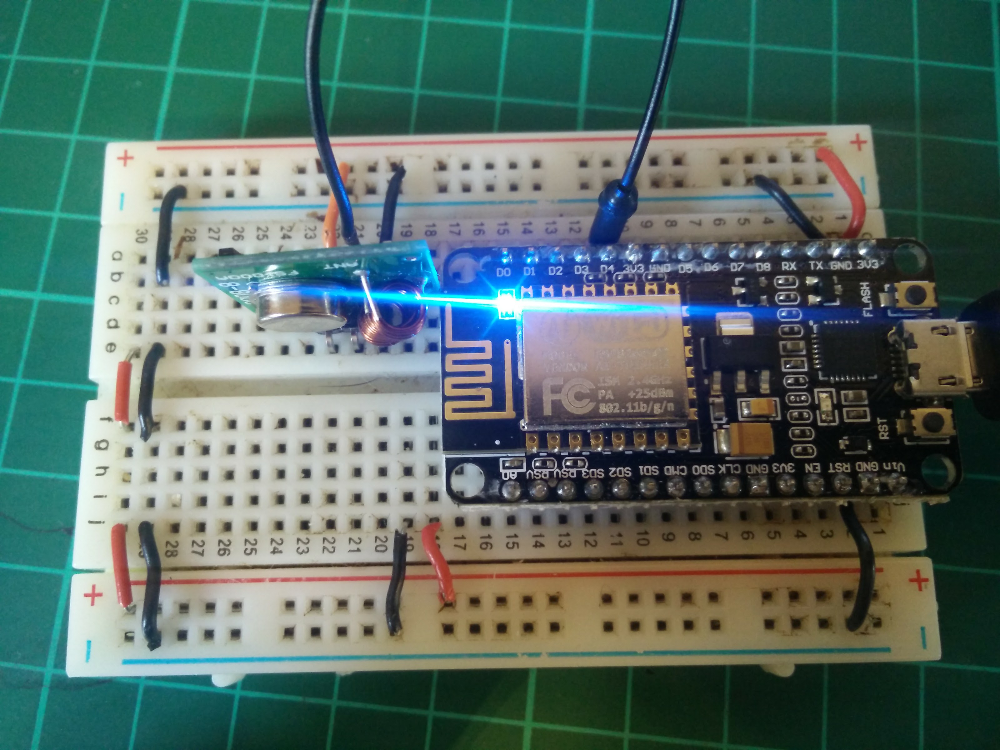

## Send radio via NodeMCU Web Server

This simple LUA script will start a web server and will send radio signals.

This wad designed to work with Smart Energenie power sockets, but it can be used to any other radio receivers.



## Load firmware

If you have installed your NodeMCU firmware already, skip step, otherwise, 
you might want to install this first.

I included the version 0.9.6 (not the latest) in this repo

First clone the esptool repo on github git clone https://github.com/themadinventor/esptool.git

Then run 

```
    cd esptool
    sudo python esptool.py --port /dev/ttyUSB0  write_flash 0x00000 ../nodemcu_integer_0.9.6-dev_20150704.bin 
```

## Radio settings

Check for radio variable in the code, and change the name and the frequency settings to adjust your own values.

## Upload code

Install ESPlorer https://esp8266.ru/esplorer/

* Open ESPlorer with Sudo (To have access to ttyUSB0)
* Open ttyUSB0 serial (9600 baud)
* Open script, Send to ESP (Ctrl+S)

## Hardware

Simply connect the Radio emitter: 
*  VCC -> 3.3v
*  GND -> GND
*  OUT -> Pin 4

If the Radio module is connected when you restart the NodeMCU, it can start rebooting itself, try to connect the module once the server is up and running.

## Usage

Check your ESPlorer log to see the web server IP, or inspect your Network to find it.

Open a web browser http://192.168.x.x/

Click on the device you want to enable / disable